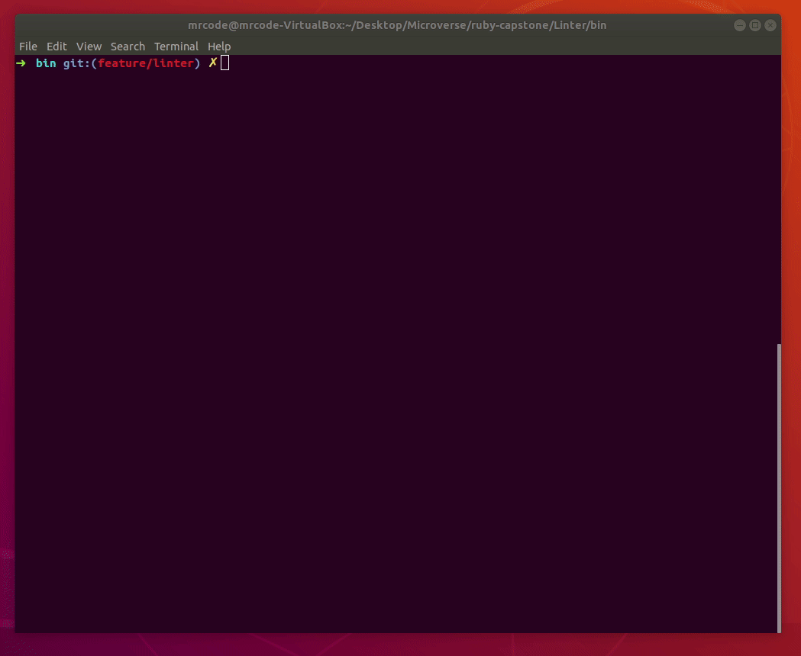

# Ruby Linter Capostone Project
# 
## Single Linter Project




This is a basic linter project created with ruby. The Linter is designed to scan the following errors in any inspected document:

1. He will return each line in wich you are missing a bracket ('[ ]' - '( )' - '{ }').
2. He will return an error if the first line on your file is a blank line.
3. He will return an error if the total lines on your file are bigger than 100.
4. He will return an error if the total lines on a single line are bigger than 120.

This project has been developed to accomplish the Ruby module capstone project at Microverse.

## Built With

- [Ruby](https://www.ruby-lang.org/en/).
- [rspec](https://rspec.info/).
- [Git](https://git-scm.com/).
- [Rubocop](https://github.com/microverseinc/linters-config/tree/master/ruby). 

## Live Demo

- [Hosted on repl.it](https://repl.it/@pipe2442/LINTER)

## Getting Started

**Install Ruby on Your Own Machine.**
**Install Git on Your Own Machine.**

### Prerequisites

- [Ruby](https://www.ruby-lang.org/en/).
- [Git](https://git-scm.com/).

### Optional

- [Rubocop](https://github.com/microverseinc/linters-config/tree/master/ruby). 
- [rspec](https://rspec.info/).

### Usage

- Create new folder.
- Open your terminal.
- Run ``` git clone https://github.com/pipe2442/Linter.git ```.
- Enter root folder with command ``` cd Linter ```.
- Enter bin folder with command ``` cd bin ```.
- Execute the program with command ``` ruby main.rb ```.
- You will find an examples folder in wich you can add any file you want to
  scan with the Linter. You just need to add the file and edit the path on
  the main.rb file.
  
# Project Screenshot


## Authors

👤 **Luis Felipe Angulo Torres**

- Github: [@donCodigo_](https://github.com/donCodigo_)
- Twitter: [@pipe2442](https://twitter.com/pipe2442)
- Linkedin: [linkedin](https://www.linkedin.com/in/luis-felipe-angulo-torres-95098b139/)

## 🤝 Contributing

Contributions, issues and feature requests are welcome!

Feel free to check the [issues page](https://github.com/pipe2442/Linter/issues).

## Show your support

Give a ⭐️ if you like this project!

## Acknowledgments

- [Thanks Microverse][https://github.com/microverseinc]
  
## 📝 License

This project is [MIT](LICENSE) licensed.
