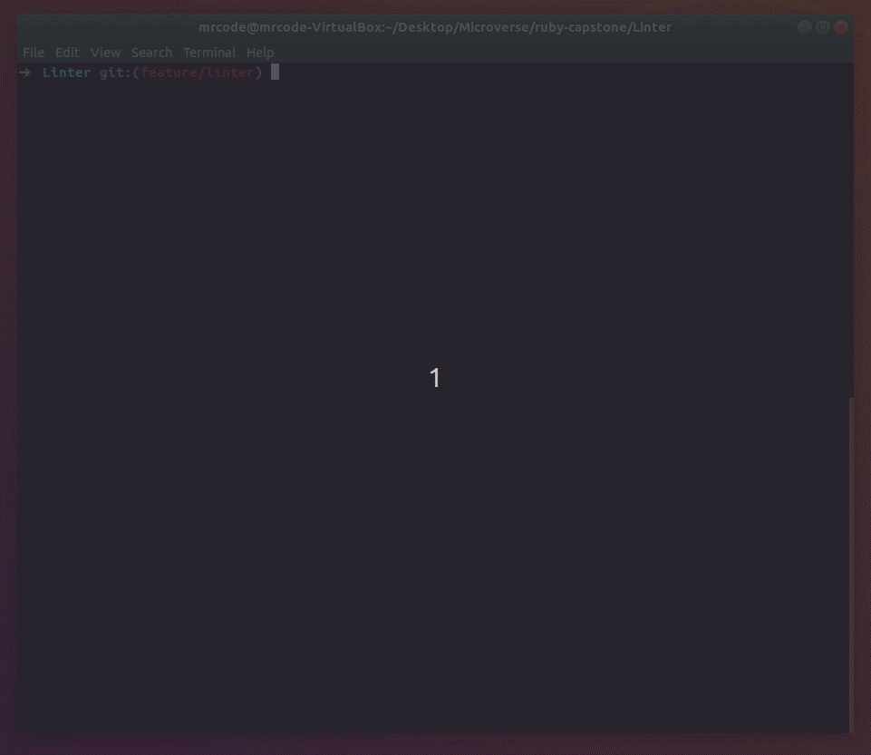

# Ruby Linter Capostone Project
# 
## Single Linter Project




This is a basic linter project created with ruby. The Linter is designed to scan the following errors in any inspected document:

1. He will return each line in wich you are missing a bracket ('[ ]' - '( )' - '{ }').
2. He will return an error if the first line on your file is a blank line.
3. He will return an error if the total length on your file (Including blank spaces) is bigger than 100.
4. He will return an error if the total length on a single line (Including blank spaces) is bigger than 120.

This project has been developed to accomplish the Ruby module capstone project at Microverse.


<div align="center">
    <h1>
        
        <a href="https://www.troweprice.com/corporate/us/en/home.html">TRowePrice</a>
    </h1>
    <h4><b>Frontend internal seller demo app for TrowePrice</b></h4>
    <h4>
        <a href="#links">Links</a>
        •
        <a href="#versions">Versions</a>
        •
        <a href="#roadmap">Roadmap</a>
        •
        <a href="#development-guide">Development guide</a>
        •
        <a href="#deployment">Deployment</a>
        •
        <a href="#contact">Contact</a>
        •
        <a href="#copyright">Copyright</a>
    </h4>
    <h3>
        <a href="https://www.github.com/koombea">
          
        </a>
        <a href="https://www.github.com/pipe2442">
          
        </a>
        <a href="https://www.github.com/dmunoz-10">
          
        </a>
        <a href="https://www.github.com/lacides">
          
        </a>
        <a href="https://www.github.com/luiskhernandez">
          
        </a>
        <a href="https://www.troweprice.com/corporate/us/en/home.html">
            
        </a>
        <a href="#License">
            
        </a>
    </h3>
</div>


## Overview

T. Rowe Price is an independent investment management firm focused on helping clients meet their objectives and achieve their long-term financial goals. Clients rely on our active management approach, which we call strategic investing, and our broad range of equity, fixed income, and multi-asset investment capabilities.

## Built With

- [React](https://reactjs.org/).
- [Typescript](https://www.typescriptlang.org/)
- [TailwindCss](https://tailwindcss.com/).
- [Jest](https://jestjs.io/). 
- [Cypress](https://www.cypress.io/).
- [Storybook](https://storybook.js.org/).
- [SizeLimit](https://github.com/ai/size-limit).
- [Commitizen](https://github.com/commitizen/cz-cli). 
- [VictoryChart](https://formidable.com/open-source/victory/docs/victory-chart/).
- [Git](https://git-scm.com/).


## Getting Started

### Clone the project on your local machine.

Run the following command on your local directory.

```bash
$ git clone git@github.com:koombea/TRP-web.git
```

### Install dependencies

```bash
$ yarn install
```

### Run development environment.

```bash
$ yarn dev
```

### Editor extensions (Optional)

It's recommended to install extensions related to the following libraries in your editor:

- Prettier
- Eslint

### Set up pre-commits

## Live Demo

- [Hosted on repl.it](https://repl.it/@pipe2442/LINTER)

## Getting Started

**Install Ruby on Your Own Machine.**
**Install Git on Your Own Machine.**

### Prerequisites

- [Ruby](https://www.ruby-lang.org/en/).
- [Git](https://git-scm.com/).

### Optional

- [Rubocop](https://github.com/microverseinc/linters-config/tree/master/ruby). 
- [rspec](https://rspec.info/).

### Usage

- Create new folder.
- Open your terminal.
- Run ``` git clone https://github.com/pipe2442/Linter.git ```.
- Enter root folder with command ``` cd Linter ```.
- Execute the program with command ``` ruby bin/main ```.
- You will find an examples folder in wich you can add any file you want to
  scan with the Linter. You just need to add the file and edit the path on
  the main.rb file.
  
# Project Screenshot


## Authors

👤 **Luis Felipe Angulo Torres**

- Github: [pipe2442](https://github.com/pipe2442)
- Twitter: [@donCodigo_](https://twitter.com/donCodigo_)
- Linkedin: [linkedin](https://www.linkedin.com/in/luis-felipe-angulo-torres-95098b139/)

## 🤝 Contributing

Contributions, issues and feature requests are welcome!

Feel free to check the [issues page](https://github.com/pipe2442/Linter/issues).

## Show your support

Give a ⭐️ if you like this project! 🤝 

## Acknowledgments

- [Thanks Microverse][https://github.com/microverseinc]
  
## 📝 License

This project is [MIT](LICENSE) licensed.
